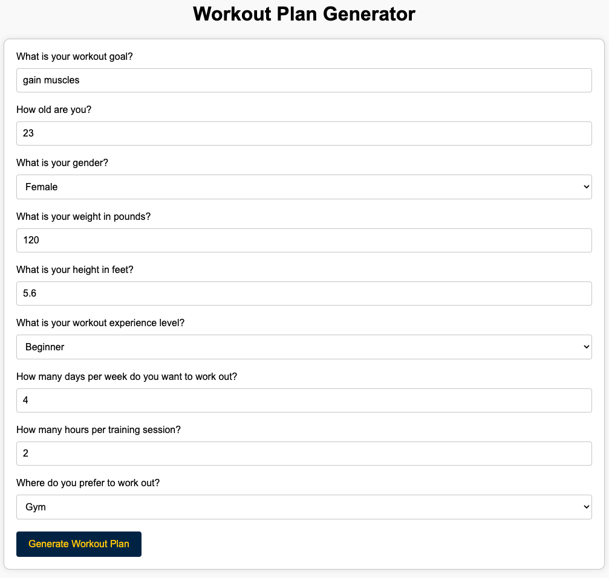
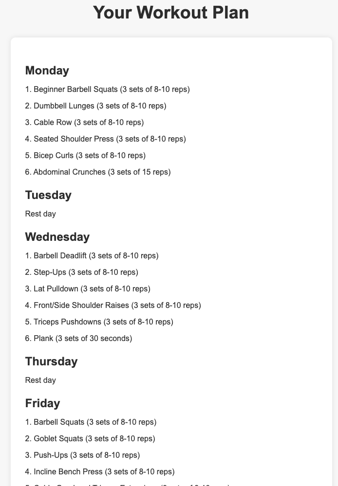
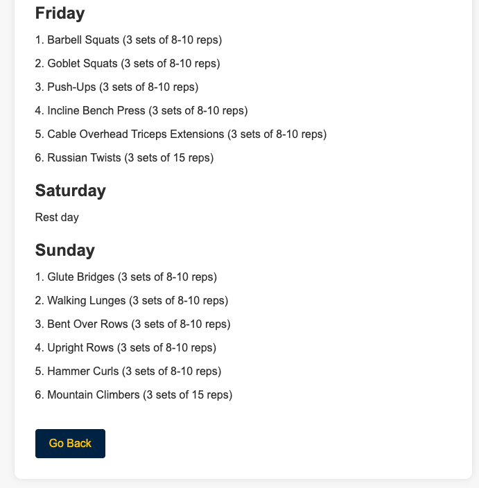

# AI Fitness Coach

## Overview

The aim of this project is to develop an application that can act like a fitness coach and generate personalized workout plans for people based on their needs and experience level. This tool will be useful for people who want to start working out but don't know where to begin or for people who want to switch up their workout routine.

## Functionality

The application consists of two main pages: the home page and the workout plan page.

### Home Page

The home page is where the user can input their personal information such as age, weight, gender, workout experience level, and their primary workout goal (e.g. lose weight, gain muscle). The user can also input how many days per week they want to work out and how many hours per training they prefer. Upon submitting this information, the user is taken to the workout plan page.

  

### Workout Plan Page

The workout plan page generates a personalized workout plan for the user based on the information they provided on the home page. The plan is divided by day of the week and includes exercises, sets, reps, and rest time. If a day does not have a workout plan, it will display as "Rest day". The workout plan is limited to 6 lines, i.e. activities per day to make it easier to read.

The user can modify their information and generate a new workout plan by clicking the "Go Back" button.

  

  

## Implementation

The application is built using Python and Flask framework. It uses OpenAI's GPT-3 language model to generate the workout plan based on the user's input. The home page is implemented using HTML and CSS, while the workout plan page is generated dynamically using Jinja2 templating engine.

## Usage

To use the application locally, clone the repository and install the required packages listed in the `requirements.txt` file. Run the `app.py` file and access the home page at `http://localhost:5000`. Fill in the form with your personal information and click "Generate Workout Plan" to see your personalized workout plan.

## Future Improvements

Some possible future improvements for this application include:

- Adding more options for workout equipment (e.g. gym, home gym, bodyweight exercises)
- Allowing the user to select specific muscle groups they want to work on
- Adding a feature to save and retrieve previous workout plans

## Credits

This application was created by Sherry Zhang as a project for SI 568. It uses the following software and services:

- Python
- Flask
- OpenAI API
